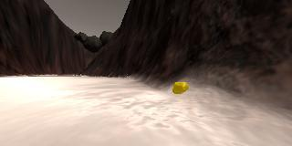
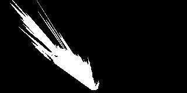
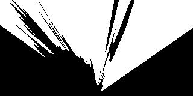

## Project: Search and Sample Return
[//]: # (### Writeup Template: You can use this file as a template for your writeup if you want to submit it as a markdown file, but feel free to use some other method and submit a pdf if you prefer.)

---

**The goals / steps of this project are the following:**  

**Training / Calibration**  

* Download the simulator and take data in "Training Mode"
* Test out the functions in the Jupyter Notebook provided
* Add functions to detect obstacles and samples of interest (golden rocks)
* Fill in the `process_image()` function with the appropriate image processing steps (perspective transform, color threshold etc.) to get from raw images to a map.  The `output_image` you create in this step should demonstrate that your mapping pipeline works.
* Use `moviepy` to process the images in your saved dataset with the `process_image()` function.  Include the video you produce as part of your submission.

**Autonomous Navigation / Mapping**

* Fill in the `perception_step()` function within the `perception.py` script with the appropriate image processing functions to create a map and update `Rover()` data (similar to what you did with `process_image()` in the notebook). 
* Fill in the `decision_step()` function within the `decision.py` script with conditional statements that take into consideration the outputs of the `perception_step()` in deciding how to issue throttle, brake and steering commands. 
* Iterate on your perception and decision function until your rover does a reasonable (need to define metric) job of navigating and mapping.  

## [Rubric](https://review.udacity.com/#!/rubrics/916/view) Points
### Here I will consider the rubric points individually and describe how I addressed each point in my implementation.  

---
### Writeup / README

#### 1. Provide a Writeup / README that includes all the rubric points and how you addressed each one.  You can submit your writeup as markdown or pdf.  

You're reading it!

### Notebook Analysis
#### 1. Run the functions provided in the notebook on test images (first with the test data provided, next on data you have recorded). Add/modify functions to allow for color selection of obstacles and rock samples.

The notebook is set up to use the data from `my_calibration_images` and `my_test_dataset` directories which include test data recorded in "Training Mode" of the rover simulator.  Using `my_calibration_images/example_grid1.jpg`, the source for the `perspect_transform()` function was update with custom values.  Also, by inspection of the rover position and camera view of the grid in "Training Mode", the `bottom_offset` was adjusted to more accurately account for the fact that the bottom of the camera view is not the position of the rover. The following figure shows the grid calibration image (left) and the same image after transformation to a top-down view:

Functions have been added and modified in order to allow for color selection of navigable terrain, obstacles, and rocks.  Given a calibration image that includes only the object of interest and white space everywhere else, the added `get_hsv_range()` function will return lower and upper HSV thresholds based on the average and standard deviation of the objects HSV values.  These thresholds can then be used in conjunction with `cv2.inRange()` from the `cv2` package in order to extract binary images of an object. These two functions together can be used arbitrarily for color selection of objects in images.  The following images show the separation of a rover camera view (top left) into calibration images for navigable terrain (top right), obstacles (bottom left), and rocks (bottom right):

Calibration images like those shown above were used to calculate HSV ranges for each terrain type, and then the `color_thresh_hsv()` function was added to use `cv2.inRange()` in order to return binary images of each terrain type, given an input image. Assurance that the obstacle binary image only includes obstacle data that is within view of the rover in the perspective transform is provided by the `within_view()` function, which returns a mask to identify the region on the transformed image that is within view.  This masking would not be needed if the color threshold was applied prior to transforming the rover image to a top-down view.  The following figure shows the results from an input image (top left) transformation into a top-down view,  and separation into navigable terrain (top right), obstacles (bottom left), and rocks (bottom right):

#### 2. Populate the `process_image()` function with the appropriate analysis steps to map pixels identifying navigable terrain, obstacles and rock samples into a worldmap.  Run `process_image()` on your test data using the `moviepy` functions provided to create video output of your result. 

The perspective transform, color thresholding, and coordinate transformation steps that were tested at the beginning of the notebook were added to the `process_image()` function.  Additionally, a `worldmap_score` array was created that is updated by adding weighted values to its obstacle, rock, and navigable channels based on the identification of each terrain type in each frame of the rover image view.  The terrain-type channels of the `worldmap` array are then updated based on the current highest score for each terrain type at each world map location.  Passing the test dataset to the `process_image()` function, a video was created with the following result for the final frame: 

The full video can be found at `output/test_mapping.mp4`.  The bottom right of the figure above shows the result from the added `rock_vector()` function, a vector pointing to the rock in a rover-centric map.  The notebook proved the basic functionality of transforming from a camera image to a rover-centric map that identifies different terrain types, and finally to a world map; however, as can be seen in the bottom left of the figure, there is a poor match between the world-map navigable-terrain identified by the `process_image()` function in blue and the ground-truth navigable-terrain in green.  Additional steps that significantly improved the fidelity of mapping were implemented in the final `perception_step()` function used by the rover, and are explained in the following section.

### Autonomous Navigation and Mapping

#### 1. Fill in the `perception_step()` (at the bottom of the `perception.py` script) and `decision_step()` (in `decision.py`) functions in the autonomous mapping scripts and an explanation is provided in the writeup of how and why these functions were modified as they were.

The proven functions and workflow tested in the `process_image()` function of the notebook were copied over to the `perception_step()` function in the `perception.py` script used by the rover.  The following additional steps were implemented to improve the fidelity of mapping:

* `worldmap_score` was updated only if the rover was level, that is to say if the rover pitch and roll were within a set tolerance (which was chosen to be 1.5 degrees).
* Only rover camera data within a specified distance of the rover was used to update `worldmap_score`, since transformation errors increase farther away from the rover.  The chosen view limit was 6.75 m.
* Score weights added to the obstacle and navigable channels of `worldmap_score` were hand tuned by trial and error to improve fidelity.
* The obstacle score was capped to be no greater than a limit within the navigable score at the same point.  This was done to mitigate erroneous obstacle identification so that it could be overcome by measurements of navigable terrain.

Since `worldmap` was already clean by updating it from the separate `worldmap_score` array, modification was made to the `create_output_images()` function of the `supporting_functions.py` script to turn off the provided map cleaning.

The `decision_step()` function of the `decision.py` script used by the rover was entirely rewritten.  Computations were primarily done by added methods (or member functions) of the `RoverState()` class in the `drive_rover.py` script.  The rover control strategy was based around the `seek_target()` method which would seek a given target in rover-centric coordinates by steering towards the target and controlling the throttle and brake through a PID controller.  Once the rover had arrived at a given target, it would be stopped and turned towards a given "look" location.  In `decision_step()` the default target was provided by the `navigable_target_follow_wall()` method which would return a bounded target that was in front and as far left of the rover as possible while remaining clear of obstacles.  This strategy encouraged the rover to follow a wall on its left side.

Various modes identified in `decision_step()` would override the default wall-following behavior of the rover, and instead give the rover a target and look position that would guide it to find an initial wall, approach a rock for pickup, attempt to get unstuck, or return to start if the mapping loop had been closed.  Other minor modes were also included such as the "return to spot" mode that would tell the rover to return to the state it was in before it altered course to pick up a rock, or the "lost" mode that would revert to navigation by rover vision instead of the world map if the rover became encircled by obstacles (according to the world map).

#### 2. Launching in autonomous mode your rover can navigate and map autonomously.  Explain your results and how you might improve them in your writeup.  

**Note: running the simulator with different choices of resolution and graphics quality may produce different results, particularly on different machines!**

[//]: # (Here I'll talk about the approach I took, what techniques I used, what worked and why, where the pipeline might fail and how I might improve it if I were going to pursue this project further.  )

Settings and the frames per second (FPS) while running the rover simulation in autonomous mode are listed in the following table:

| Screen Resolution | Graphics Quality | Frames Per Second |
|:-----------------:|:----------------:|:-----------------:|
| 640 x 480         | Good             | 16                |

With the implemented `decision_step()`, `perception_step()`, and `RoverState()` methods, the rover was able to map approximatley 93% of the domain with 95% fidelity, pickup all of the 6 rocks, and return to the start...most of the time.  The rover still occasionally bumps into obstacles, misses a rock, or passes a tight space without mapping it, but the majority of the time it appears to succeed!  The following image shows the results from a run in which the rover collected all the rocks, mapped 93% of the domain with a fidelity of 95%, and returned to start within 765 seconds:

The full video can be found at `output/rover_run-1_stats_5x.mp4`.  The time only increases from here if the rover gets stuck more often.  Typically, the rover will eventually make its way to a rock, or get unstuck if given enough time; becoming permanently stuck generally occurs only as a result of glitches in the simulator, such as the camera showing a navigable path in front of the rover when it is actually stuck halfway into a boulder.

Improvements to rover performance would likely come by implementing more sophisticated path planning, such as A\* with path smoothing and penalties for proximity to obstacles.  Smoothing the speed control would likely improve the mapping by providing more frames that the rover is considered level. Also, only propogating the edge of obstacles to `worldmap_score` would decrease the instances of obstacles overriding terrain that is actually navigable.

